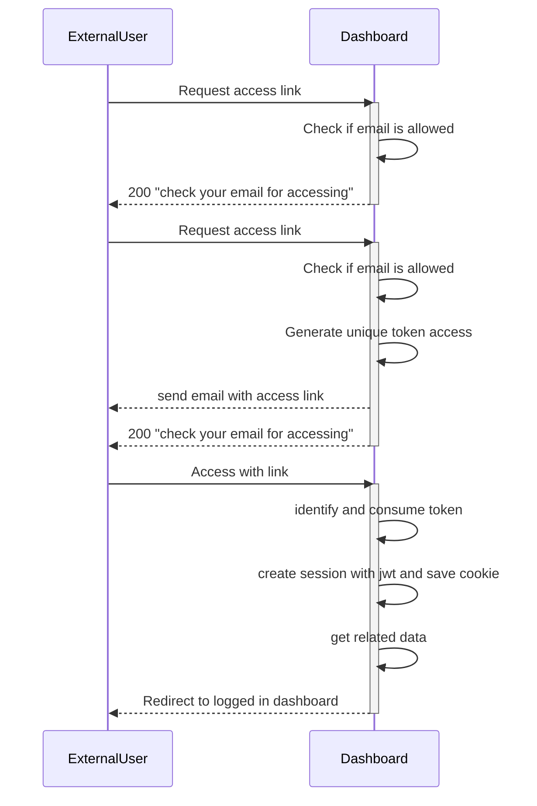

## Cookie Authentication

This comes from a real case scenario I had to solve at work. For the specific project we needed to give access to a special type of user that wasn't part of our normal users. They only needed access from time to time to fullfil small amount of tasks.
Also because of constraints on how users and roles worked, I had to treat these type of users different. This is why I went for a magic-link approach, where our special users will need to request access in a separate login page.

After their request, the user would receive an email with a link containing a unique token. That link would hit our API, identify and consume the token, and create a jwt session cookie.

With this approach we could make sure, only the owner of the saved email would be able to request access and then login and that the link wasn't shareable.

The Frontend then could use the cookie to access protected endpoints and be able to uniquely determine the user that is logged in.

## Diagram of use case

